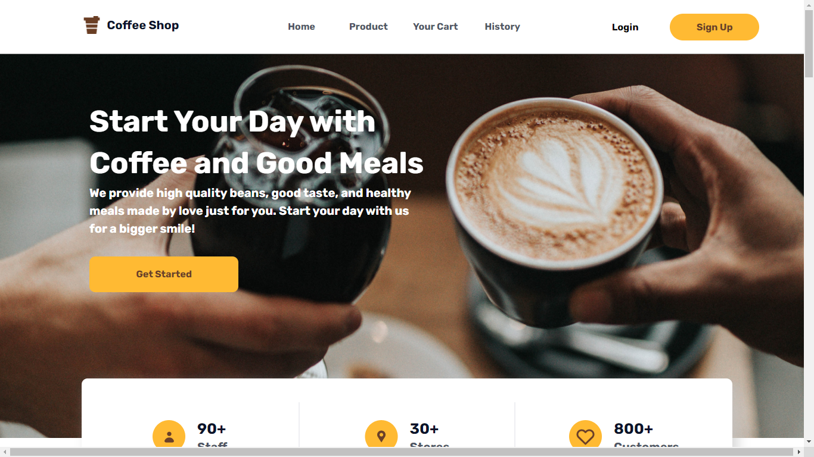
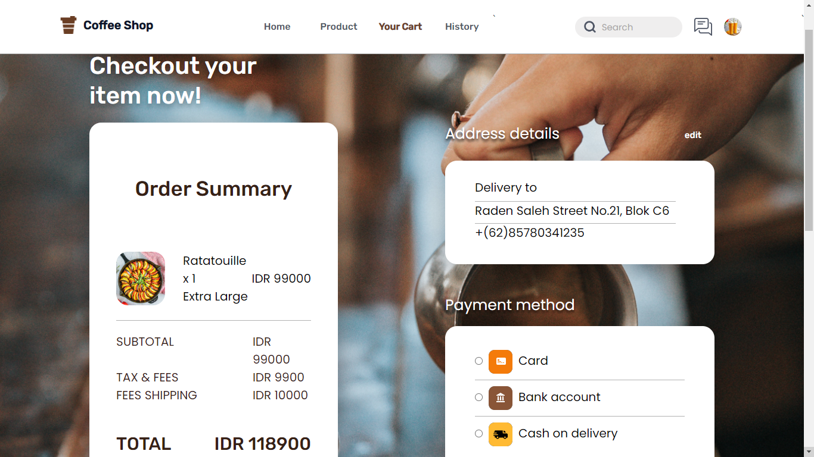
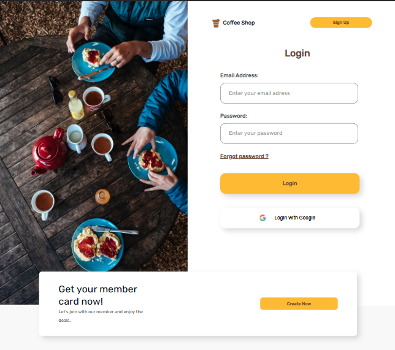
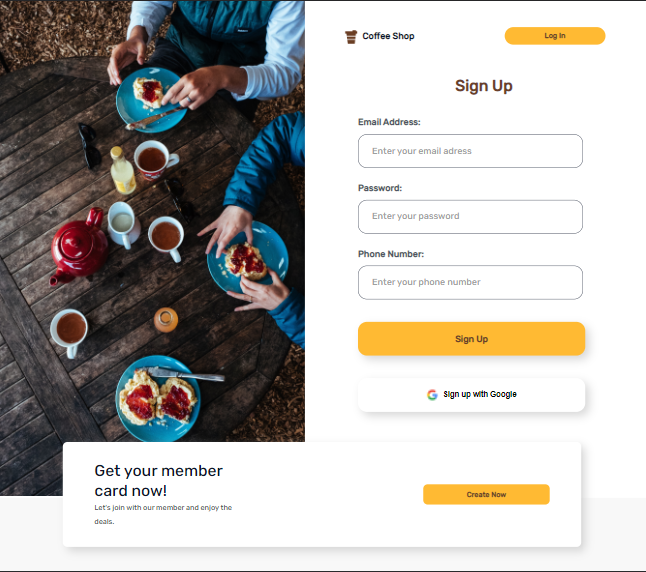
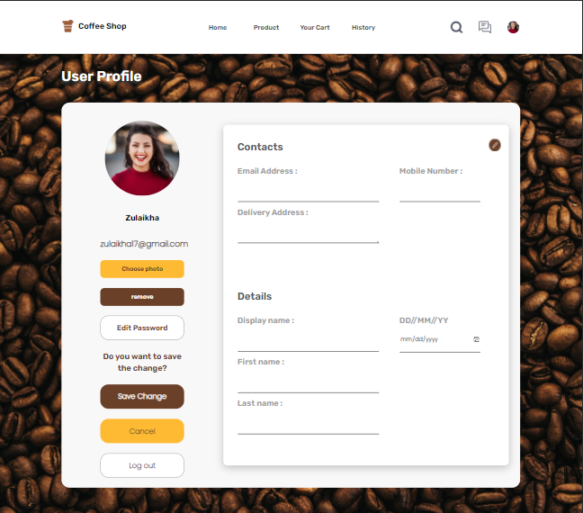
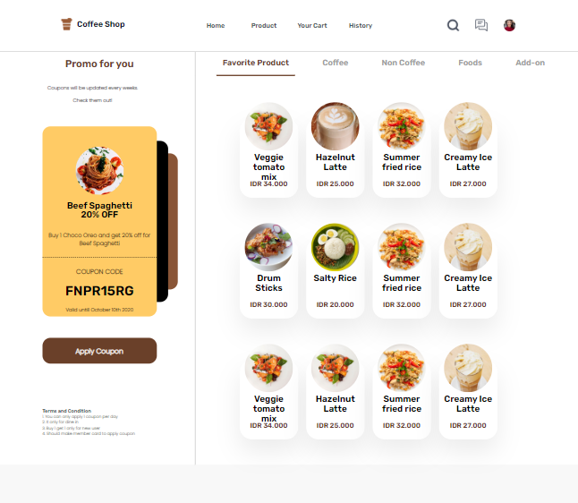

<h1 style="text-align:center">Starbills Coffee Shop Frontend</h1>

<div style="display:flex; justify-content:center; margin-bottom:40px;">
    
</div>

# Introduction
<div style="display:flex; flex-direction:row; column-gap:20px; margin-bottom:20px">


</div>

<h2>How to Install</h2>

Clone the repository below and open the file using [VSCode](https://code.visualstudio.com/download)

    ```
    https://github.com/billhikmah/CoffeeShop-Frontend-React
    ```

<h2>Deploy</h2>

This client side has been created with React.js framework and deployed on [Netlify](https://starbills.netlify.app/)


    ```
    https://starbills.netlify.app/
    ```

<h2>Package</h2>

In addition to using the React.js framework, this frontend is also supported by the following packages:

1. [axios](https://www.npmjs.com/package/axios)
2. [bootstrap](https://www.npmjs.com/package/bootstrap)
3. [react-bootstrap](https://www.npmjs.com/package/react-bootstrap)
4. [react-router-dom](https://www.npmjs.com/package/react-router-dom)
5. [redux](https://www.npmjs.com/package/redux)
6. [morgan](https://www.npmjs.com/package/morgan)
7. [eslint](https://www.npmjs.com/package/eslint)
8. [dotenv](https://www.npmjs.com/package/dotenv)


<h2>Preview</h2>

<div style="display:flex; justify-content: left; column-gap:20px; margin-bottom:20px">




</div>

<div style="display:flex; justify-content: left; column-gap:20px; margin-bottom:20px">




</div>

<h2>Related Documentation</h2>

1. Server (Backend)<br>
    Server documentation can be accessed via [Postman](https://documenter.getpostman.com/view/20723287/UyrEguSx) or [Github Repository](https://github.com/billhikmah/Coffee-Shop-Project). The backend also has been deployed to [Heroku](https://www.heroku.com) and the assets have been uploaded to [Cloudinary](https://www.cloudinary.app/).

2. HTML & CSS (Frontend)<br>
    The client side has been documented with HTML & CSS and deployed on [Netlify](ttps://www.cloudinary.com).
